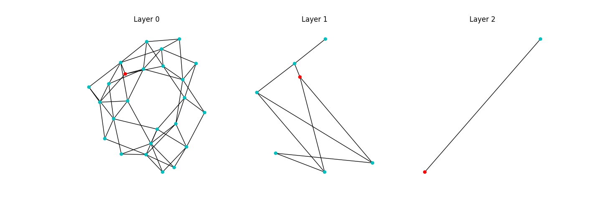

# `tinyhnsw` - the littlest vector database

TinyHNSW is a tiny, simple vector database.
It weighs in at a measly few hundred lines of code.
It's built on a straightforward (but not fast) implementation of HNSW in Python with minimal dependencies.
It has an associated set of tutorials that build up to understanding how HNSW works, and how you can build your own TinyHNSW.

⚠️ The vector database part of this works, but the tutorial is not yet complete. I will update the README checklist below as chapters and code are completed.

⚠️ `tinyhnsw` is NOT production-quality.
Compared to literally *any* standard implementation, it's slow and probably buggy.
If you want to use an Approximate Nearest Neighbor library in a real application, consider something like FAISS.

# Tutorial Outline

1. [ ] [Introduction](chapters/0_introduction.md)
2. [ ] [Nearest Neighbor Search](chapters/1_nearest_neighbor_search.md)
3. [ ] [An Overview of HNSW](chapters/2_hnsw_overview.md)
4. [ ] [Skip Lists](chapters/3_skip_lists.md)
5. [ ] [Navigable Small Worlds](chapters/4_navigable_small_worlds.md)
6. [ ] [HNSW](chapters/5_hnsw.md)
7. [ ] [Limitations](chapters/6_limitations.md)
8. [ ] [Filtering and Hybrid Search](chapters/7_filtering.md)
9. [ ] [Multimodal Retrieval with CLIP](examples/multimodal_retrieval/README.md)
10. [ ] [Searching Text with Sentence Transformers](examples/sentence_transformers/README.md)

## Code

1. [x] [Nearest Neighbor Search](tinyhnsw/knn.py)
2. [x] [Skip Lists](tinyhnsw/teaching/skip_list.py)
3. [x] [Navigable Small Worlds](tinyhnsw/teaching/nsw.py)
4. [x] [HNSW](tinyhnsw/hnsw.py)
5. [x] [Filtering and Hybrid Search](tinyhnsw/filter.py)
6. [x] [Multimodal Retrieval with CLIP](examples/multimodal_retrieval/multimodal_retrieval.py)
7. [ ] [Searching Text with Sentence Transformers](examples/sentence_transformers/sentence_transformers.py)

# Library Usage

With the disclaimers out of the way, here is how you use it/set it up.

## Installation

To install `tinyhnsw`, run the following command:

```sh
pip install -Ue .
```

This will install the library and all its dependencies (`numpy`, `networkx`, `scipy`, `tqdm`).

## Usage

### HNSW Index

```python
from tinyhnsw import HNSWIndex

import numpy

vectors = numpy.random.randn(100, 10)

index = HNSWIndex(d=10)
index.add(vectors)

print(index.ntotal)
# => 100
```

#### HNSW Visualizations

You can also visualize each layer of the HNSW graph using the following code:

```python
from tinyhnsw.visualization import visualize_hnsw_index

# ... set up index here

visualize_hnsw_index(index)
```

Which will generate a representation like the following:



### Full NN Index

You can evaluate the full nearest neighbors index with the following command:

```python
from tinyhnsw.utils import load_sift, evaluate
from tinyhnsw import FullNNIndex

data, queries, labels = load_sift()

index = FullNNIndex(128)
index.add(data)

D, I = index.search(queries, k=10)

print(f"Recall@1: {evaluate(labels, I[:, 0])}")
```

On my M2 MacBook Air with `numpy=1.26.2`, that runs in 0.25s and results in a recall@1 of 98%.

### Skip Lists

📝 As part of understanding how HNSW works, the tutorial walks you through how skip lists work and how to implement one. 
However, this implementation is not particularly robust and only works with integer keys.
It's there for teaching purposes, as understanding skip lists will really help understand how HNSW works.

You can use the skip lists as follows:

```python
from tinyhnsw.skip_list import SkipList

list = [3, 2, 1, 7, 14, 9, 6]
s = SkipList(list)
print(s)
```

Which will return something like the following (but not exactly, it's a random data structure after all):

```
2 |   2 3     9
1 |   2 3 6   9 14
0 | 1 2 3 6 7 9 14
```

You have a few basic operations:

```python
s.find(3)
# => Node(value=3, pointers=[...])
s.delete(3)
# => None ; removes item from skiplist
s.insert(5)
# => None ; inserts the element 5
s.tolist()
# => [1, 2, 5, 6, 7, 9, 14]
```

### Navigable Small Worlds (NSWs)

📝 The second part of understanding how HNSW works is understanding how NSWs work.
Again, we provide a teaching implementation in this repo, but it's not meant for much more than teaching.

## Proofs of Concept with CLIP and Sentence Transformers

```sh
python examples/multimodal_retrieval/multimodal_retrieval.py "animated scene"
```


## Testing

There are a few different kinds of tests in this repo:

1. correctness tests
2. timing tests
3. accuracy tests

### Correctness Tests

To run the correctness tests, simply run:

```sh
poetry run pytest
```

### Timing Tests

Make sure you've downloaded the data:

```sh
python tinyhnsw/utils.py
```

Which will download the [SIFT10K dataset](http://corpus-texmex.irisa.fr) to the `data/` folder.

On my machine, index creation for 10k vectors to get to 100% recall takes `22 seconds`.

### Accuracy Tests

We use SIFT10k to evaluate the different indexes, scoring them with Recall@1 (on my machine, with a random seed):

| Index | Recall@1 |
| ----- | -------- |
| `FullNNIndex` | 1.00  |
| `HNSWIndex (simple)`  | 1.00  |
| `HNSWIndex (heuristic)` | 1.00 |